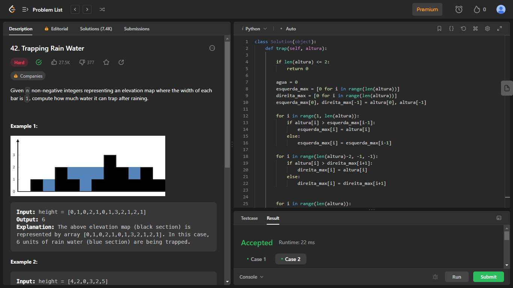

# PD_Exercicios_Dupla39

**Número da Lista**: 2<br>
**Conteúdo da Disciplina**: Programação Dinâmica<br>

## Alunos
|Matrícula | Aluno |
| -- | -- |
| 17/0154319  |  Philipe de Sousa Barros |
| 20/0042416  |  Pablo Christianno Silva Guedes |

## Sobre 
Este trabalho envolve a resolução de exercícios que abordam o conteúdo do módulo de Programação dinâmica da disciplina de Projeto de Algoritmos. O foco principal é a aplicação de algoritmos relacionados com toda a classe de problemas de programação dinâmica

## Screenshots
### Exercicio 1 - "Trapping Rain Water"
**Nível do exercício:** Difícil



Para acessar a página do exercício [clique aqui](https://leetcode.com/problems/trapping-rain-water/description/)

**Linguagem**: Python<br>
**Framework**: <br>
### Vídeo do Exercício 1 
O arquivo do vídeo (.mp4) do exercício um se encontra na pasta videos -> [video](./videos/Exercicio1_Philipe_PD.mp4)

### Exercicio 2 - ""
**Nível do exercício:** Médio


Para acessar a página do exercício [clique aqui]()

**Linguagem**: Python<br>
**Framework**: <br>
### Vídeo do Exercício 2
O arquivo do vídeo (.mp4) do exercício dois se encontra na pasta videos -> [video]()
 
Disponível também no Youtube [clique aqui]()


<br>

## Instalação 
**Linguagem**: Python<br>

Caso queira testar localmente é necessário instalar python:

- ### Windows
Baixe o pacote Python do [site official](https://www.python.org/downloads/), e no momento da instação, marque a opção "Add Python to PATH".

- ### Linux
Execute no terminal do linux a atualização dos pacotes e instalação do python3

```bash
sudo apt-get update
sudo apt-get install python3
```


## Uso 
Para verificar o funcionamento basta abrir o link do exercicio e copiar o código referente a questão, e logo após realizar o envio. Caso queira verificar localmente, é necessário executar o programa, e para isto basta utilizar o comando:

`python NomeDoArquivo.py`


